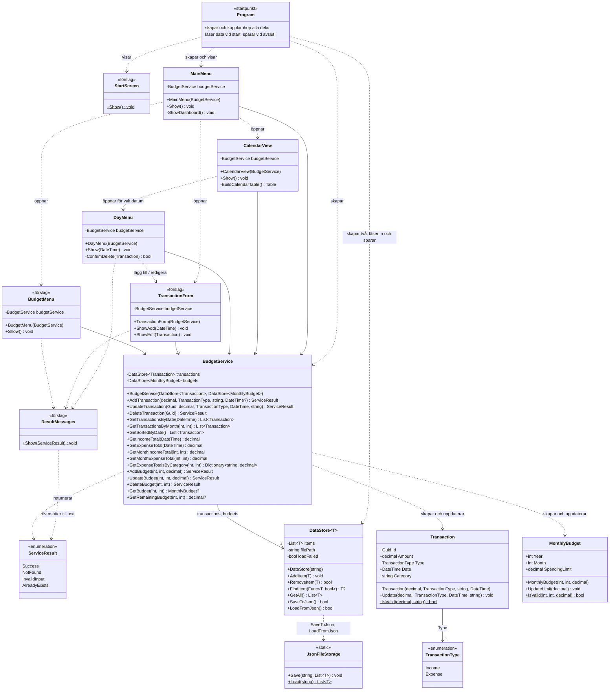

```mermaid
classDiagram
    direction TB

    class Program {
        <<startpunkt>>
        skapar och kopplar ihop alla delar
        läser data vid start, sparar vid avslut
    }

    %% UI/
    class StartScreen {
        <<förslag>>
        +Show()$ void
    }
    class MainMenu {
        -BudgetService budgetService
        +MainMenu(BudgetService)
        +Show() void
        -ShowDashboard() void
    }
    class CalendarView {
        -BudgetService budgetService
        +CalendarView(BudgetService)
        +Show() void
        -BuildCalendarTable() Table
    }
    class DayMenu {
        -BudgetService budgetService
        +DayMenu(BudgetService)
        +Show(DateTime) void
        -ConfirmDelete(Transaction) bool
    }
    class TransactionForm {
        <<förslag>>
        -BudgetService budgetService
        +TransactionForm(BudgetService)
        +ShowAdd(DateTime) void
        +ShowEdit(Transaction) void
    }
    class BudgetMenu {
        <<förslag>>
        -BudgetService budgetService
        +BudgetMenu(BudgetService)
        +Show() void
    }
    class ResultMessages {
        <<förslag>>
        +Show(ServiceResult)$ void
    }

    %% Services/
    class BudgetService {
        -DataStore~Transaction~ transactions
        -DataStore~MonthlyBudget~ budgets
        +BudgetService(DataStore~Transaction~, DataStore~MonthlyBudget~)
        +AddTransaction(decimal, TransactionType, string, DateTime?) ServiceResult
        +UpdateTransaction(Guid, decimal, TransactionType, DateTime, string) ServiceResult
        +DeleteTransaction(Guid) ServiceResult
        +GetTransactionsByDate(DateTime) List~Transaction~
        +GetTransactionsByMonth(int, int) List~Transaction~
        +GetSortedByDate() List~Transaction~
        +GetIncomeTotal(DateTime) decimal
        +GetExpenseTotal(DateTime) decimal
        +GetMonthIncomeTotal(int, int) decimal
        +GetMonthExpenseTotal(int, int) decimal
        +GetExpenseTotalsByCategory(int, int) Dictionary~string, decimal~
        +AddBudget(int, int, decimal) ServiceResult
        +UpdateBudget(int, int, decimal) ServiceResult
        +DeleteBudget(int, int) ServiceResult
        +GetBudget(int, int) MonthlyBudget?
        +GetRemainingBudget(int, int) decimal?
    }
    class ServiceResult {
        <<enumeration>>
        Success
        NotFound
        InvalidInput
        AlreadyExists
    }
    class DataStore~T~ {
        -List~T~ items
        -string filePath
        -bool loadFailed
        +DataStore(string)
        +AddItem(T) void
        +RemoveItem(T) bool
        +FindItem(Func~T, bool~) T?
        +GetAll() List~T~
        +SaveToJson() bool
        +LoadFromJson() bool
    }
    class JsonFileStorage {
        <<static>>
        +Save(string, List~T~)$ void
        +Load(string)$ List~T~
    }

    %% Models/
    class Transaction {
        +Guid Id
        +decimal Amount
        +TransactionType Type
        +DateTime Date
        +string Category
        +Transaction(decimal, TransactionType, string, DateTime)
        +Update(decimal, TransactionType, DateTime, string) void
        +IsValid(decimal, string)$ bool
    }
    class TransactionType {
        <<enumeration>>
        Income
        Expense
    }
    class MonthlyBudget {
        +int Year
        +int Month
        +decimal SpendingLimit
        +MonthlyBudget(int, int, decimal)
        +UpdateLimit(decimal) void
        +IsValid(int, int, decimal)$ bool
    }

    %% Uppstart (issue 12)
    Program ..> StartScreen : visar
    Program ..> DataStore~T~ : skapar två, läser in och sparar
    Program ..> BudgetService : skapar
    Program ..> MainMenu : skapar och visar

    %% Gränssnitt (issue 4)
    MainMenu ..> CalendarView : öppnar
    MainMenu ..> TransactionForm : öppnar
    MainMenu ..> BudgetMenu : öppnar
    CalendarView ..> DayMenu : öppnar för valt datum
    DayMenu ..> TransactionForm : lägg till / redigera
    MainMenu --> BudgetService
    CalendarView --> BudgetService
    DayMenu --> BudgetService
    TransactionForm --> BudgetService
    BudgetMenu --> BudgetService
    DayMenu ..> ResultMessages
    TransactionForm ..> ResultMessages
    BudgetMenu ..> ResultMessages
    ResultMessages ..> ServiceResult : översätter till text

    %% Logik och lagring (issue 7–11)
    BudgetService --> "2" DataStore~T~ : transactions, budgets
    BudgetService ..> ServiceResult : returnerar
    BudgetService ..> Transaction : skapar och uppdaterar
    BudgetService ..> MonthlyBudget : skapar och uppdaterar
    DataStore~T~ ..> JsonFileStorage : SaveToJson, LoadFromJson
    Transaction --> "1" TransactionType : Type
```
